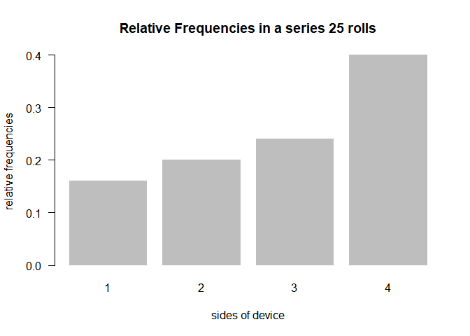

Report\_workout03
================
Harinandan Srikanth
2018-12-02

Rolling a Device
----------------

The package `"roller"` utilizes two classes of objects, "device" and "rolls", in order to randomly generate values from a "sides" vector that have the probabilities stored in a "prob" vector.

Creating a `device` object
--------------------------

`"device"` objects have two parameters: "sides" and "prob". "sides" is a vector containing the sides of the device, which can be strings, characters, etc. There must be more than one side and no sides can be repeated. "prob" is a vector containing the respective probabilities of each side being rolled on a given roll. The probabilities must be numeric and sum to 1. The default device object (device()) will have sides = c(1,2) and prob = c(0.5,0.5). An example of a non-default device object would be device(sides=c('q','w','e'),prob=c((1/4),(1/2),(1/4))). Every `device` object returns a list comprised of the sides and prob vectors (list(sides = sides, prob = prob)).

``` r
#default device object
dev1 <- device()
dev1
#> object "device"
#> 
#>   side prob
#> 1    1  0.5
#> 2    2  0.5

#non-default object
dev2 <- device(sides = c('q','w','e'), prob = c((1/4),(1/2),(1/4)))
dev2
#> object "device"
#> 
#>   side prob
#> 1    q 0.25
#> 2    w 0.50
#> 3    e 0.25
```

Creating a `rolls` object
-------------------------

`"rolls"` objects have two parameters: "device" and "times". "device" is a device object and "times" is the number of times you want to roll the device. Every `rolls` object returns a list with the following components: "rolls": a vector of the sides rolled "sides": a vector of the sides of the `device` "prob": a vector of the probabilties of the sides "total": the number of rolls ("times") To clarify, every `rolls` object returns list(rolls,sides,prob,total).

``` r
#rolls object
rolls1 <- roll(dev1,5)
rolls1
#> object "rolls"
#> 
#> $rolls
#> [1] 1 1 2 2 1

#rolls object
rolls2 <- roll(dev2,12)
rolls2
#> object "rolls"
#> 
#> $rolls
#>  [1] "e" "w" "e" "w" "e" "q" "w" "q" "e" "q" "q" "w"
```

Additional functions
--------------------

The function is.device() has a single parameter "x". If "x" is a `device` object, then is.device(x) returns TRUE. If "x" is NOT a `device` object, then is.device(x) returns FALSE.

The function print.device() takes a `device` object "x" as its parameter. It prints a data frame of the sides of "x" and their probabilities, with the header 'object "device"'.

The function summary.rolls() has a single parameter "x", which needs to be a `rolls` object. summary.rolls(x) returns a list containing a data frame of the sides of the 'device' conatined in "x", the counts of how many times each side was rolled in the total number of rolls, and the proportions of the total number of rolls in which each side appeared. Printing summary(x) yields the data frame itself (not in a list) with the header 'summary "rolls"'.

The plot.rolls() function has a single parameter "x", a `rolls` object. plot.rolls(x) displays a barplot of the side frequencies in the rolls.

The extraction method "\[" takes two parameters: "x", a `rolls` object, and "rolls\_index", an index corresponding to one of the rolls. This method returns the side that was rolled on the roll corresponding to "rolls\_index".

The replacement method "\[&lt;-" takes three parameters: "x", a `rolls` object, "rolls\_index", an index corresponding to one of the rolls, and "value", a side belonging to the device parameter of "x". This method returns "x" after the side rolled on the roll corresponding to "rolls\_index" is replaced by "value".

The addition method "+" take two parameters: "x", a `rolls` object, and "incr", a numeric element with a value greater than 0 and length equal to 1. This method returns "x" after new rolls have been added to its "rolls" component.

``` r
#is.device()
is.device(device(c("a","b"),c(0.4,0.6)))
#> [1] TRUE
is.device(c(0.5,0.5))
#> [1] FALSE

#device()
device_example <- device(sides = c("g","h","j"), prob = c(0.3,0.5,0.2))
device_example
#> object "device"
#> 
#>   side prob
#> 1    g  0.3
#> 2    h  0.5
#> 3    j  0.2
print(device_example)
#> object "device"
#> 
#>   side prob
#> 1    g  0.3
#> 2    h  0.5
#> 3    j  0.2

#roll() (class of object is `rolls`, not roll)
set.seed(123)
rolls_example <- roll(device(sides = c(1,2,3,4), prob = c(0.1, 0.2, 0.4, 0.3)), times = 25)
rolls_example
#> object "rolls"
#> 
#> $rolls
#>  [1] 3 2 4 2 1 3 4 2 4 4 1 4 4 4 3 2 3 3 3 1 2 4 4 1 4

#summary of rolls object
summary(rolls_example)
#> summary "rolls"
#> 
#>   side count prop
#> 1    1     4 0.16
#> 2    2     5 0.20
#> 3    3     6 0.24
#> 4    4    10 0.40

#plot
plot(rolls_example)
```



``` r

#extraction
rolls_example[14]
#> [1] 4

#replacement
rolls_example[14] <- 2

#rolls_example #The new rolls_example after replacement
rolls_example[14]
#> [1] 2

#addition
rolls_example + 15
#> object "rolls"
#> 
#> $rolls
#>  [1] 3 2 4 2 1 3 4 2 4 4 1 4 4 2 3 2 3 3 3 1 2 4 4 1 4 2 4 4 3 3 1 1 4 2 3
#> [36] 4 2 3 3 3
```
