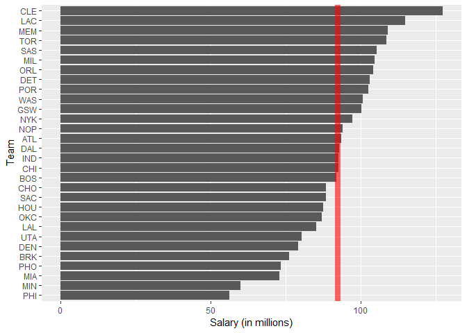
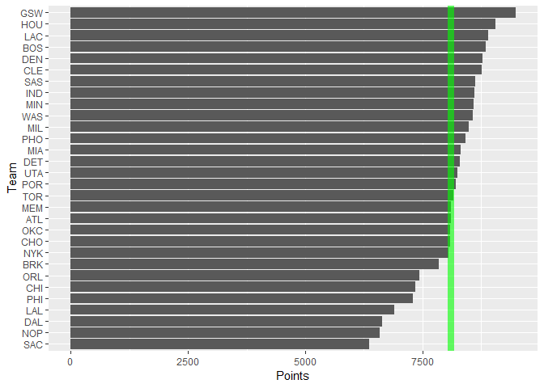
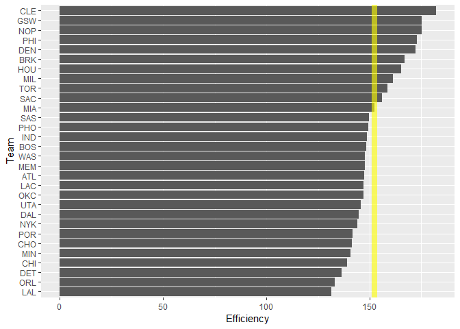
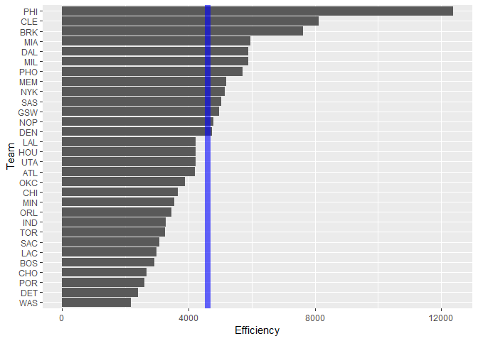

Workout 1 Markdown
================
Harinandan Srikanth
September 30, 2018

``` r
library(ggplot2)
```

    ## Warning: package 'ggplot2' was built under R version 3.5.1

``` r
library(readr)
library(dplyr)
```

    ## Warning: package 'dplyr' was built under R version 3.5.1

    ## 
    ## Attaching package: 'dplyr'

    ## The following objects are masked from 'package:stats':
    ## 
    ##     filter, lag

    ## The following objects are masked from 'package:base':
    ## 
    ##     intersect, setdiff, setequal, union

``` r
dat_nba <- read_csv('../data/nba2018-teams.csv')
```

    ## Parsed with column specification:
    ## cols(
    ##   team = col_character(),
    ##   experience = col_integer(),
    ##   salary = col_double(),
    ##   points3 = col_integer(),
    ##   points2 = col_integer(),
    ##   points1 = col_integer(),
    ##   points = col_integer(),
    ##   off_rebounds = col_integer(),
    ##   def_rebounds = col_integer(),
    ##   assists = col_integer(),
    ##   steals = col_integer(),
    ##   blocks = col_integer(),
    ##   turnovers = col_integer(),
    ##   fouls = col_integer(),
    ##   efficiency = col_double()
    ## )

``` r
dat_nba_sbyt <- summarise(group_by(dat_nba, team), total_salary = sum(salary))
dat_nba_sbyt <- arrange(dat_nba_sbyt, total_salary)
dat_nba_sbyt$team <- factor(dat_nba_sbyt$team, levels = dat_nba_sbyt$team, ordered = TRUE)
```

``` r
bar_team_salary <- ggplot(data=dat_nba_sbyt, aes(x=dat_nba_sbyt$team, y=dat_nba_sbyt$total_salary)) + geom_col() + xlab("Team") + ylab("Salary (in millions)") + geom_hline(aes(yintercept=mean(dat_nba_sbyt$total_salary)), color='red', size = 3, alpha=0.6) + coord_flip()
bar_team_salary
```



``` r
dat_nba_points <- summarise(group_by(dat_nba, team), total_points = sum(points))
dat_nba_points <- arrange(dat_nba_points, total_points)
dat_nba_points$team <- factor(dat_nba_points$team, levels = dat_nba_points$team, ordered = TRUE)
dat_nba_points
```

    ## # A tibble: 30 x 2
    ##    team  total_points
    ##    <ord>        <int>
    ##  1 SAC           6360
    ##  2 NOP           6597
    ##  3 DAL           6651
    ##  4 LAL           6905
    ##  5 PHI           7299
    ##  6 CHI           7349
    ##  7 ORL           7442
    ##  8 BRK           7855
    ##  9 NYK           8060
    ## 10 CHO           8099
    ## # ... with 20 more rows

``` r
bar_team_points <- ggplot(data=dat_nba_points, aes(x=dat_nba_points$team,y=dat_nba_points$total_points)) + geom_col() + xlab("Team") + ylab("Points") + geom_hline(aes(yintercept=mean(dat_nba_points$total_points)), color='green', size=3, alpha=0.6) + coord_flip()
bar_team_points
```



``` r
dat_nba_eff <- summarise(group_by(dat_nba, team), total_efficiency = sum(efficiency))
dat_nba_eff <- arrange(dat_nba_eff, total_efficiency)
dat_nba_eff$team <- factor(dat_nba_eff$team, levels = dat_nba_eff$team, ordered = TRUE)
dat_nba_eff
```

    ## # A tibble: 30 x 2
    ##    team  total_efficiency
    ##    <ord>            <dbl>
    ##  1 LAL               131.
    ##  2 ORL               133.
    ##  3 DET               136.
    ##  4 CHI               139.
    ##  5 MIN               141.
    ##  6 CHO               142.
    ##  7 POR               142.
    ##  8 NYK               144.
    ##  9 DAL               145.
    ## 10 UTA               146.
    ## # ... with 20 more rows

``` r
bar_team_eff <- ggplot(data=dat_nba_eff, aes(x=dat_nba_eff$team,y=dat_nba_eff$total_efficiency)) + geom_col() + xlab("Team") + ylab("Efficiency") + geom_hline(aes(yintercept=mean(dat_nba_eff$total_efficiency)), color='yellow', size=3, alpha=0.6) + coord_flip()
bar_team_eff
```



``` r
# ignoring missed free throws and missed field goals for the dollar efficiency calculation
dollar_eff <- (dat_nba$points + dat_nba$off_rebounds + dat_nba$def_rebounds + dat_nba$assists + dat_nba$steals + dat_nba$blocks - dat_nba$turnovers) / dat_nba$salary 
dat_nba <- mutate(dat_nba, dollar_efficiency=dollar_eff) 

dat_nba_dollar_eff <- summarise(group_by(dat_nba, team), total_dollar_eff = sum(dollar_efficiency))
dat_nba_dollar_eff <- arrange(dat_nba_dollar_eff, total_dollar_eff)
dat_nba_dollar_eff$team <- factor(dat_nba_dollar_eff$team, levels = dat_nba_dollar_eff$team, ordered = TRUE)
dat_nba_dollar_eff
```

    ## # A tibble: 30 x 2
    ##    team  total_dollar_eff
    ##    <ord>            <dbl>
    ##  1 WAS              2163.
    ##  2 DET              2407.
    ##  3 POR              2602.
    ##  4 CHO              2674.
    ##  5 BOS              2923.
    ##  6 LAC              2991.
    ##  7 SAC              3075.
    ##  8 TOR              3259.
    ##  9 IND              3287.
    ## 10 ORL              3454.
    ## # ... with 20 more rows

``` r
bar_team_dollar_eff <- ggplot(data=dat_nba_dollar_eff, aes(x=dat_nba_dollar_eff$team,y=dat_nba_dollar_eff$total_dollar_eff)) + geom_col() + xlab("Team") + ylab("Efficiency") + geom_hline(aes(yintercept=mean(dat_nba_dollar_eff$total_dollar_eff)), color='blue', size=3, alpha=0.6) + coord_flip()
bar_team_dollar_eff
```



Rational behind dollar\_efficiency: This index measures how many points each team is winning for the amount money that the investor(s) of that team is paying it. This is a good index for ranking teams because a team will be ranked higher if the amount of money an investor is spending on it is worth it.

-   Was this your first time working on a project with such file structure? If yes, how do you feel about it?
-   Yes. I find it very interesting that the sink function allows you to both create a file and add content to that file while only operating in R and not even opening the file.
-   Was this your first time using relative paths? If yes, can you tell why they are important for reproducibility purposes?
-   No. I have used relative paths in Git Bash in previous assignments for this class.
-   Was this your first time using an R script? If yes, what do you think about just writing code (without markdown syntax)?
-   No.
-   What things were hard, even though you saw them in class/lab?
-   I personally feel that for this assignment, there was nothing that we saw in class or lab that ended up being hard for me in this assignment.
-   What was easy(-ish) even though we haven't done it in class/lab?
-   Even though we hadn't done it in class, creating the bar charts was easy once I figured out which graphical functions to use.
-   Did anyone help you completing the assignment? If so, who?
-   No one helped me in completing this assignment. The only help I got was from the internet when I was researching how to turn the bar charts sideways.
-   How much time did it take to complete this HW?
-   It took about 8 hours to complete this homework.
-   What was the most time consuming part?
-   The most time consuming part was creating the dictionary and describing every column label.
-   Was there anything interesting?
-   I think the sink function was really interesting because of how convenient it was for creating files and adding content to them.
